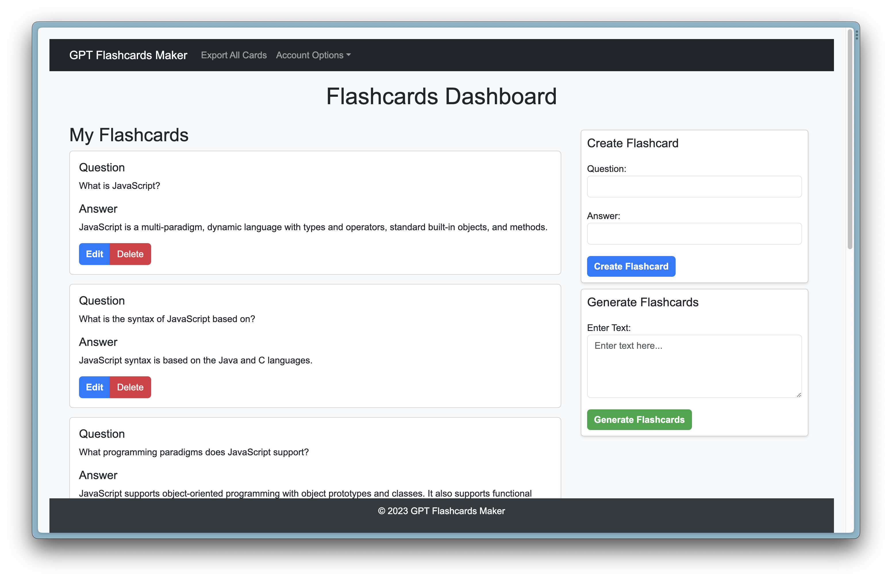

# GPT FlashCards Maker

Welcome to GPT FlashCards Maker, a web application designed to simplify the creation of flashcards using the OpenAI GPT API. This project is built using Express and MongoDB, allowing you to create and manage flashcards with ease.



## Table of Contents

- [GPT FlashCards Maker](#gpt-flashcards-maker)
  - [Table of Contents](#table-of-contents)
  - [Introduction](#introduction)
  - [Features](#features)
  - [Demo](#demo)
  - [Installation](#installation)
  - [Usage](#usage)
  - [Technologies](#technologies)
  - [License](#license)

## Introduction

GPT FlashCards Maker is a powerful tool for creating flashcards. It leverages the OpenAI GPT API to make the flashcard creation process more efficient and user-friendly. Whether you're a student or a professional, this application will help you generate and organize flashcards for effective learning.

## Features

- **Flashcard Creation**: Quickly generate flashcards with questions and answers.
- **Easy Organization**: Create, edit, and delete flashcards with a user-friendly interface.
- **OpenAI GPT Integration**: Utilizes the OpenAI GPT API for generating flashcards from text.
- **Export**: Download your flashcards for offline use or sharing with others.
- **Responsive Design**: Access your flashcards from any device with a responsive web interface.

## Demo

You can access the live demo of GPT FlashCards Maker at [Demo Link](https://gpt-flashcards-maker.onrender.com/).

## Installation

To run this project locally, follow these steps:

1. Clone this repository:

   ```bash
   git clone https://github.com/ldgze/GPT-flashcards-maker
   ```

2. Navigate to the project directory:

   ```bash
   cd gpt-flashcards-maker
   ```

3. Install project dependencies using npm:

   ```bash
   $ npm install
   ```

4. Make a copy of the example environment variables file

   On Linux systems:

   ```bash
   $ cp .env.example .env
   ```

   On Windows:

   ```powershell
   $ copy .env.example .env
   ```

5. Add your [API key](https://platform.openai.com/account/api-keys) to the newly created `.env` file
6. Add your [MongoDB Atlas Connection String](https://www.mongodb.com/docs/drivers/node/current/quick-start/create-a-connection-string/) to the newly created `.env` file
7. Run the app

   ```bash
   $ npm start
   ```

You should now be able to access the app at [http://localhost:3000](http://localhost:3000)!

## Usage

Create flashcards by providing questions and answers.
Utilize the OpenAI GPT API to generate flashcards from text.
Organize your flashcards for efficient studying.
Download flashcards for offline use or sharing.

## Technologies

Express.js
MongoDB
OpenAI GPT API
HTML, CSS, JavaScript
Bootstrap

## License

This project is licensed under the MIT License. See the LICENSE file for details.
